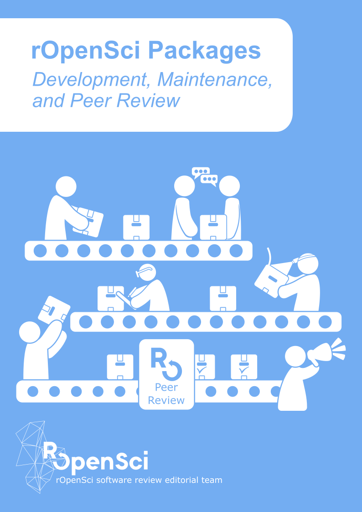

## {.center}

::: {.big-line}
AI is changing *why* people come to our communities, 
*how* they find us, 
and how they *interact with each other*.
:::

::: {.legend}
Three stories. For each one: 
[🛠 an idea for community managers]{.managers-dot} · [💬 an idea for community members]{.members-dot}
:::

::: notes
AI is changing why people come to our communities, 
how they find us, 
and how they interact with each other.
I'll share three stories. For each one, an idea for us as community managers, and an idea for community memebrs.
:::

## From *information* to *judgment* and *trust*

[📖 LatinR · from a Slack message in 2017 to 9 editions in 2026]{.story}

:::: {.columns}
::: {.column width="56%"}

:::

::: {.column width="44%"}

::: {.card .managers}
[🛠 For community managers]{.label}

Your value is moving from **information** to **judgment and trust**: knowing *who*, and trusting them enough to build something together.
:::

 

::: {.card .members}
[💬 For community members]{.label}

> AI gives you answers. Here you find people you can trust, and build with.
:::
:::
::::

::: notes
STORY: In October 2017, Heather Turner posted in the RLadies+ organizers' Slack: the R Foundation wanted academic R events in regions useR! didn't cover. I also got a DM by Heather about organizing a conference in Latin America. Within a week, six of us were on a video call. None of us had ever met in person. By mid-November we had a name, a venue, a date, and an international
organizing committee. This year, LatinR had its ninth edition. We dared to do it because we already knew each other from RLadies.

POINT: AI could have told us how to organize a conference. It couldn't give us people we trusted enough to do it with. Information is cheap now. Judgment and trust are scarce, and that's what communities offer.

:::

## Build intentional on-ramps

[The help question was an accidental on-ramp. It's weakening.]{.subtitle-line}

[📖 Andrea Gómez Vargas · ARcenso · rOpenSci Champion]{.story}

:::: {.columns}
::: {.column width="56%"}

:::

::: {.column width="44%"}
::: {.card .managers}
[🛠 For community managers]{.label}

Design on-ramps that **don't depend on someone being stuck**: calls, coworking, cohorts, hackathons, group reviews, and a "good first review" alongside "good first issue."
:::

 

::: {.card .members}
[💬 For community members]{.label}

> Come to an event. Share a use case, write about your thing, give feedback. No question needed.
:::
:::
::::

::: notes
STORY: Andrea Gómez Vargas is a sociologist in Argentina. She works at INDEC, our national statistics office. She had an idea: a package with Argentina's census data. It stayed up in the air until the rOpenSci Champions call opened and she got the support she need it. Today ARcenso exists, and she presented it at useR! 2025. As she put it: she started out searching for solutions, and ended up building one.

POINT: Her first on-ramp was accidental: searching for help. What made her a developer was intentional: an invitation, a program, people saying "you can."
If AI answers the help question privately, the accidental door closes. We need doors that don't depend on someone being stuck.
:::

::: {.small-link}
[ARcenso: a Package Born From Chaos, Powered by Community](https://soyandrea.github.io/arcenso-useR2025/)
:::

## Rewrite the social contract
[📖 rOpenSci software peer review in the era of AI]{.story}

:::: {.columns}
::: {.column width="44%"}

:::

::: {.column width="56%"}
::: {.card .managers}
[🛠 For community managers]{.label}

Write down new norms: **transparency** about AI use from everyone, **human judgment** in every human conversation, and the **freedom to choose** where to give your time. Start with a first version; iterate in the open.
:::

 

::: {.card .members}
[💬 For community members]{.label}

> Here, people give you their time to help you grow.
Show up as yourself, responsible for any AI content you share.
Our reviewers are here to help you, not to validate AI-generated code.
:::
:::
::::

::: {.small-link}
[ropensci.org/blog/2026/02/26/ropensci-ai-policy](https://ropensci.org/blog/2026/02/26/ropensci-ai-policy/)
:::

::: notes

Recently, rOpenSci received a package from a teacher who wanted his students' work to live beyond the semester. It was his first package, built with heavy AI support, and submitted before we had any AI policy. The review was tricky. One reviewer decline (they didn't want to review machine generated code). Our editor did a great job and kept asking for what we always ask: explain your decisions, point to each change, own your code, answer with your voice. And the author did it. The package passed review.

Here's the tension. If we had closed the door on AI-built packages, we would have left out this teacher and his students. If we accept everything without norms, we burn out the volunteers who make review possible.

POINT: The old contract was unwritten: someone gives you their time, and you bring your own thinking. AI strains it. So beyond the contract, we need new norms for living together. 
:::

## {.center}

::: {.fragment}
::: {.big-line}
AI gives you answers. Communities give you people.  
:::
:::

::: {.fragment}
::: {.big-line}
AI answers can be wrong. Connecting with people never is.
:::
:::

::: notes
AI gives you answers. Communities give you people.
AI answers can be wrong. Connecting with people never is. 
A community gives you judgment, a place, a role, connections, trust.
:::

## Resources {.smaller}

- rOpenSci, [*Software Review in the Era of AI: What We Are Testing* (2026)](https://ropensci.org/blog/2026/02/26/ropensci-ai-policy/)
- Andrea Gómez Vargas & Emanuel Ciardullo, [*ARcenso: a Package Born From Chaos, Powered by Community* (useR! 2025)](https://soyandrea.github.io/arcenso-useR2025/)
- [rOpenSci Champions Program](https://ropensci.org/champions/)
- [LatinR](https://latin-r.com/)
- [rOpenSci anniversary series with examples of contributions and a path in a community beyond coding](https://ropensci.org/tags/anniversary/) 
- Joel and Athanasia. [Teaching Targets with Penguins](https://ropensci.org/blog/2023/07/20/teaching-targets-with-penguins/)
- Athanasia Mo Mowinckel. [Why ggseg Atlases Became Function Calls](https://drmowinckels.io/blog/2026/atlases-as-functions/)
